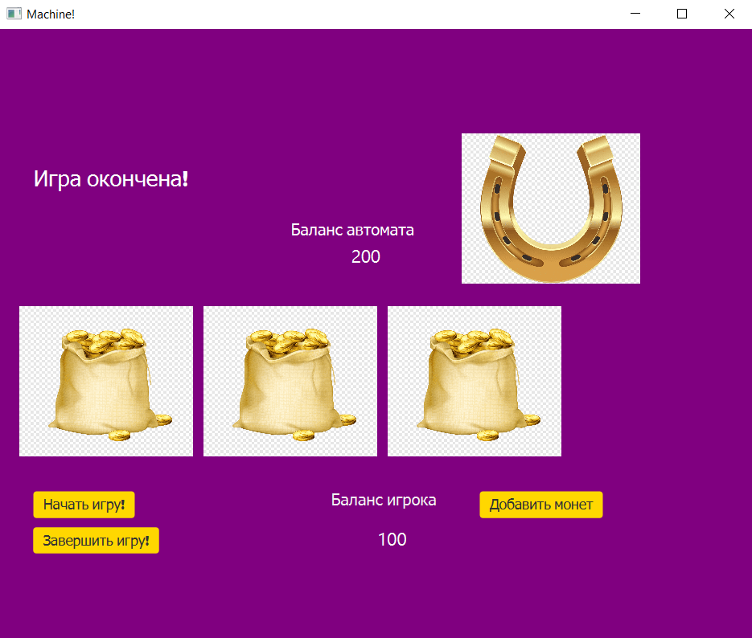

# Chain-of-Responsibility (Task 14)
## В ходе выполнения задания, в практической работе был реализован:
Игровой автомат со следующим геймплеем:
Пользователю предлагается три мешочка (один из которых якобы выигрышный), пользователь выбирает мешочек 
- либо в нем нет монеток - он проиграл, тогда он может снова кинуть монетку для продолжения игры, 
- либо  в нем есть монетки -  пользователь может забрать выигрыш и закончить игру или  может снова играть на выигранное.
## Интерфейс программы
### Главное окно программы.

### Начало игры.

### Проигрыш.

### Выигрыш.

### Нет монет.

### Добавлены монеты.

### Игра окончена.

