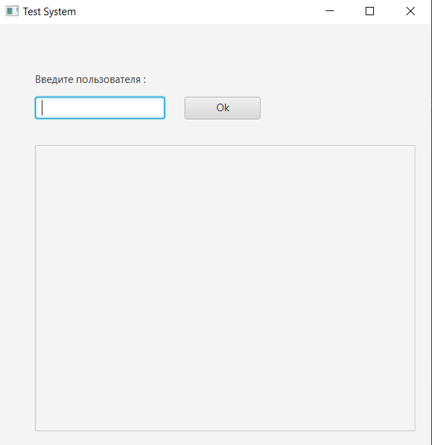
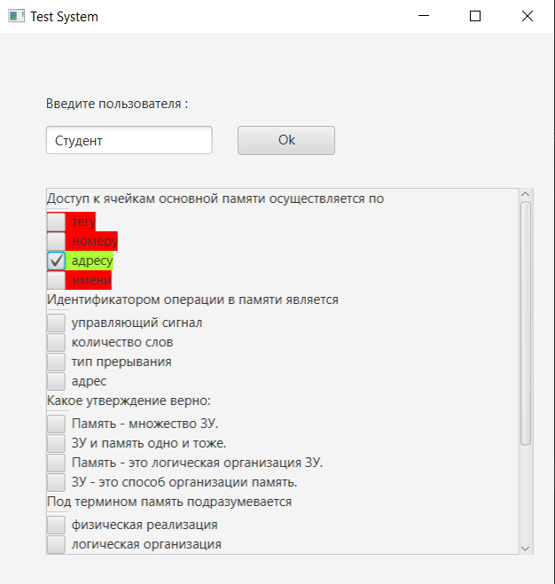
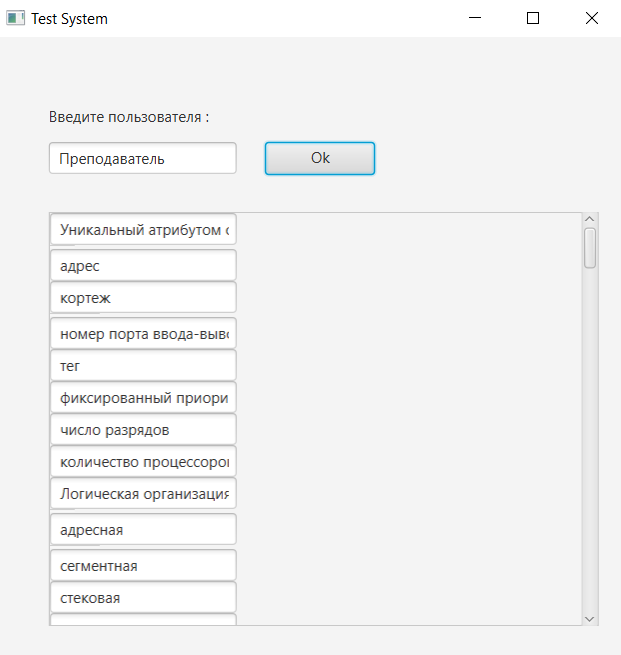
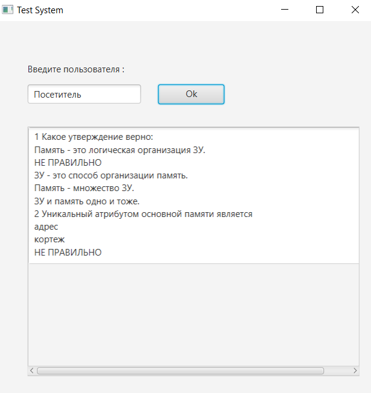

# Task 11. Посредник (Mediator)
## В ходе выполнения задания, в практической работе были реализованы:
- Режим редактирования (пользователь Преподаватель) предполагает вывод полей редактирования с вопросом и всеми правильными, а потом всеми неправильными ответами.
- Режим тестирования (пользователь Студент) предполагает вывод вопроса и 1 правильного   и   3 неправильных ответов.
- Режим чтения (пользователь Посетитель) предполагает вывод только для чтения - списка, каждый элемент которого состоит из вопроса, 1 правильного   и   3 неправильных ответов (размер списка=число правильных ответов).
Для организации взаимодействия был использован паттерн Mediator. Посредник в зависимости от введенного логина запускает соответствующий режим
## Интерфейс программы
### Главное окно программы.

### Пользователь Студент.

### Пользователь Преподаватель.

### Пользователь Посетитель.

