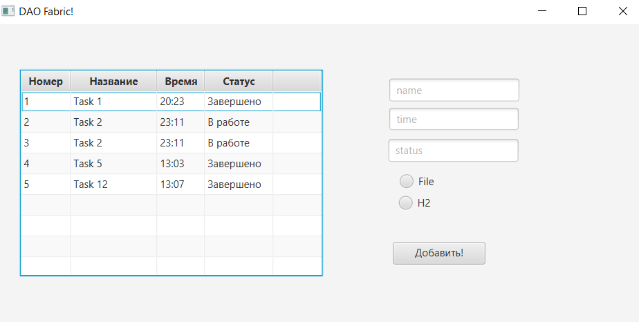
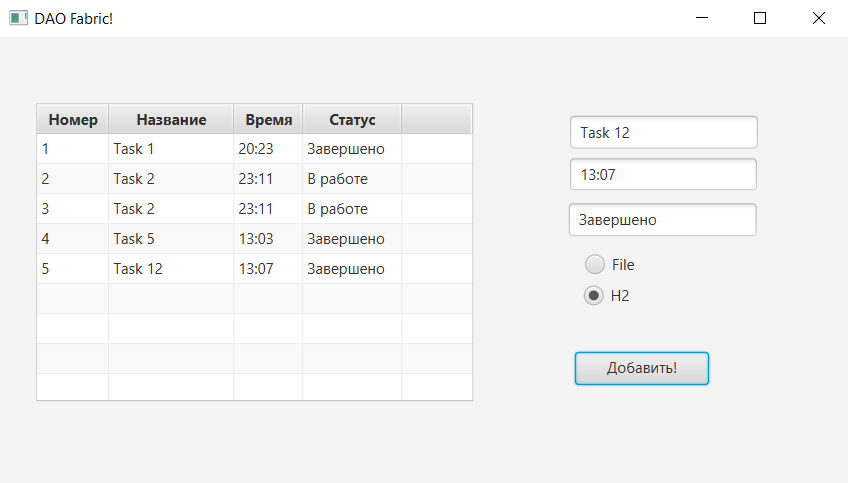
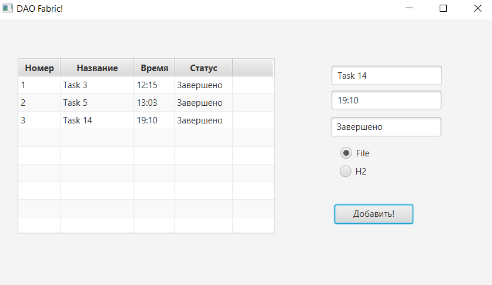
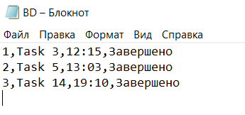

# Task-8A-DAO 
## В ходе выполнения задания, в практической работе было реализовано:
Программное средство, которое позволяет добавлять данные в таблицу базы данных. 
Имеется возможность добавить новую запись как в базу данных, так и в текстовый файл на выбор пользователя.
## Интерфейс программы
### Главное окно программы.

### Добавление записи в базу данных.

### Добавление записи в текстовый файл.

### Текстовый файл.

